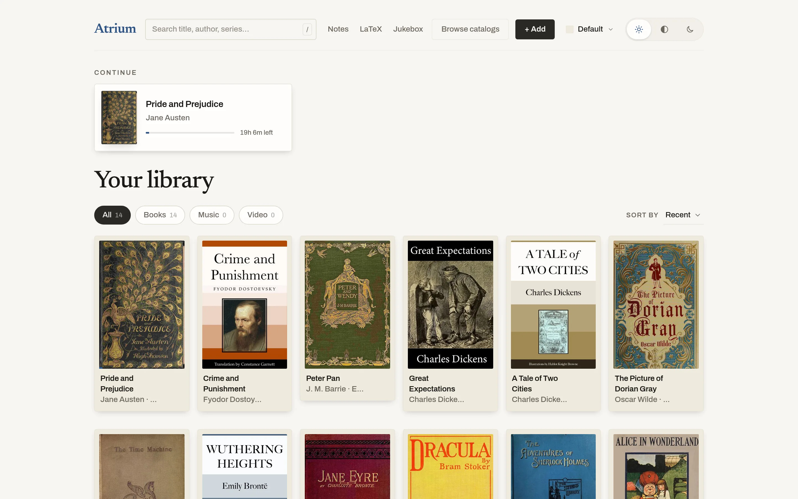
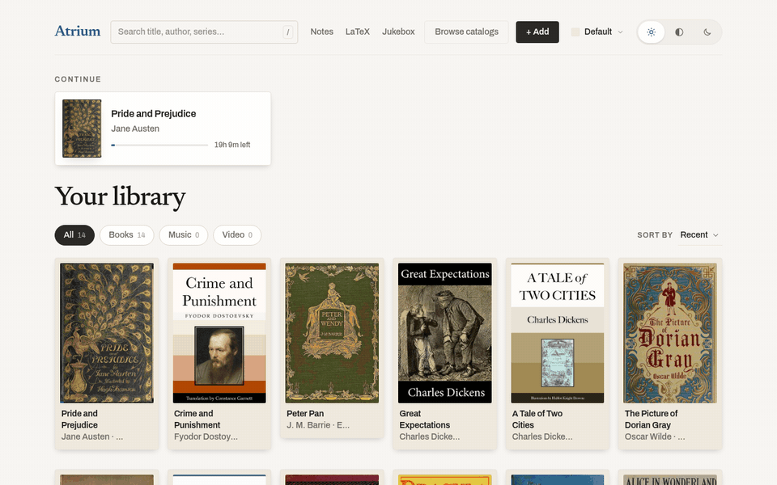
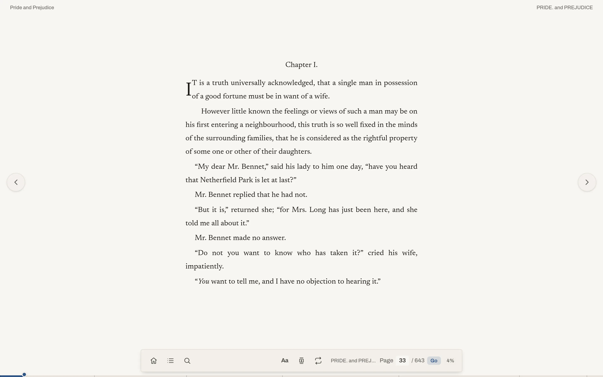
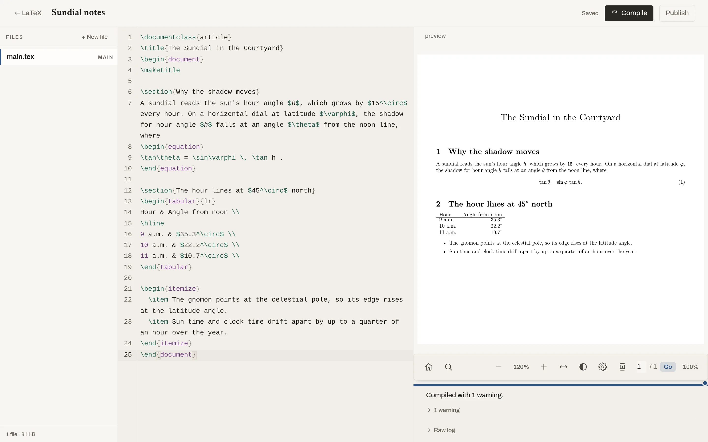
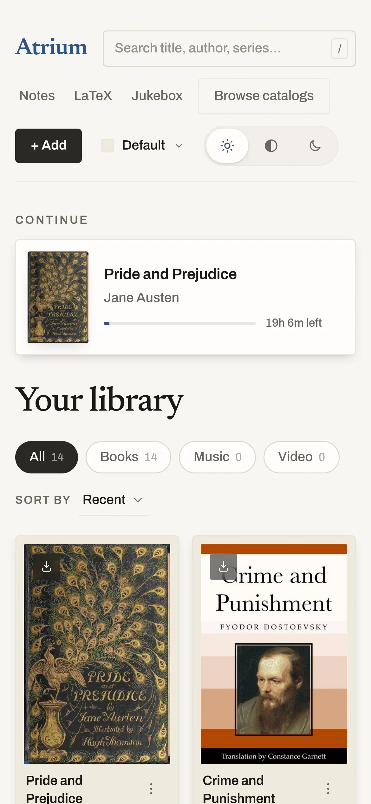
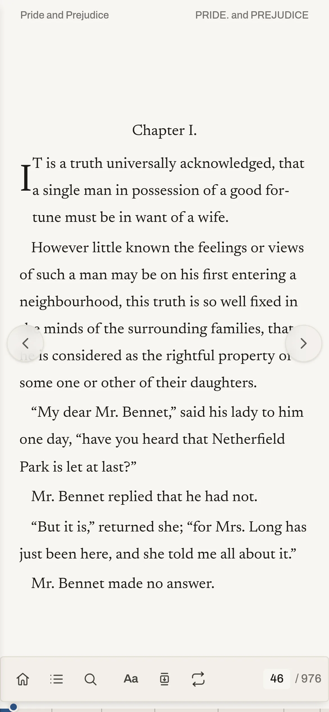

# Atrium

A private library and reading room for one household: your own books, music and video on your own server, read and played in the browser, with notebooks and LaTeX documents in the same place.

<p align="center">
  
</p>

**Status:** Personal project, built and used by its owner. Deployed at https://gandolh.ro/atrium/ behind the estate's sign-in, with no public sign-up. The newest part, the Jukebox (a remote for a Discord music bot), is built but waits on a deploy.

## What it does

- Keeps books (EPUB, PDF), music (MP3) and video (MP4, WebM) in one library on your server. Covers come out of the files, and free classics can be imported from Project Gutenberg.
- Opens EPUB and PDF in the browser, with page turns, contents, search, three themes, two typefaces, and adjustable size, spacing and margins.
- Gives each person in the household a profile with their own reading position and settings. Switching profiles takes one tap and no password.
- Installs as an app and keeps downloaded books readable offline.
- Converts a book between EPUB and PDF with Calibre and keeps both copies linked.
- Holds paged notebooks (pen strokes and text boxes) and LaTeX projects. LaTeX compiles with Atrium's own TypeScript engine, so no TeX install is needed, and a compiled document can be published into the library.

It is deliberately smaller than a media server such as Jellyfin. It takes files by upload rather than watching a folder, reads metadata only from the files, plays only the formats a browser plays without transcoding, and has no accounts of its own. Sign-in belongs to Ward, the estate's identity service.

## Screenshots

<p align="center">
  
</p>

In the clip, Pride and Prejudice opens from the Continue card, three pages turn, and the reader settings (the "Aa" button) switch the theme from Light to Sepia to Dark.

| The reader, with its bar showing | LaTeX: source, compiled preview and log |
|---|---|
|  |  |

| Library on a phone | Reader on a phone |
|---|---|
|  |  |

## How it works

`apps/web` is a React and Vite app, and the browser renders the books itself (epub.js for EPUB, PDF.js for PDF). `apps/api` is a Fastify server that stores files and covers on disk, keeps rows and per-profile progress in SQLite, runs Calibre conversions, and compiles LaTeX with `packages/typeset` on a worker thread. `packages/shared` holds the Zod contracts both apps import. Every API request carries Ward's session cookie, and a guard checks it on every route except `/health`. More in [docs/architecture.md](docs/architecture.md).

## Run it locally

Requires Node 24 or later and a local Ward, the container in the sibling repo's `wzd_auth/infrastructure/local`. Its `seed.mjs` writes atrium's Ward settings into `.env`. Calibre is optional; without it only Convert fails.

```bash
npm install
cp .env.example .env     # then run Ward's seed.mjs to fill in WARD_APP_KEY
npm run dev              # web on :5173, API on :3001
```

Then open http://localhost:5173/atrium/ and sign in through Ward. Starting Ward, using a scratch library, env vars and tests: [docs/getting-started.md](docs/getting-started.md).

## Project layout

| Path | What lives there |
|---|---|
| `apps/web` | The client: library, reader, notes, LaTeX editor, Jukebox |
| `apps/api` | The API: library storage, profiles and progress, Convert, LaTeX compiles, Jukebox |
| `apps/docs` | The Starlight docs site, built from `corpus/` and the TypeScript |
| `packages/shared` | Zod schemas and types shared by web and API |
| `packages/typeset` | The LaTeX-subset typesetting engine |
| `infrastructure` | Dockerfile and compose file for the API container |
| `corpus` | Project wiki and the briefs that built it |

## Docs

- [docs/](docs/README.md): setup, architecture and the images used here
- Docs site: https://gandolh.ro/atrium/docs/ (source in `apps/docs`)
- Project wiki: [corpus/](corpus/index.md), with the decisions, glossary, status and briefs

## License

No license yet; all rights reserved.
