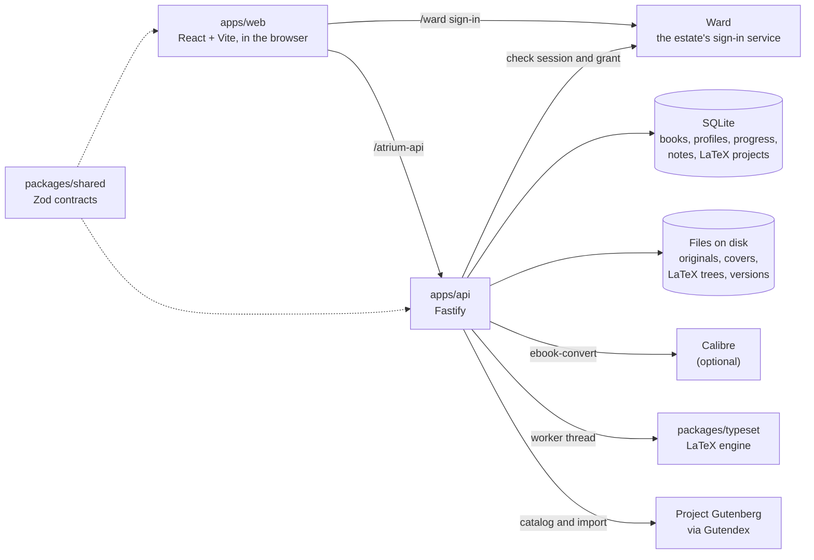

# Architecture

Atrium is an npm-workspaces monorepo with two apps and two packages. The browser does the reading; the API owns the files, the database and the jobs; Ward owns identity.

- **apps/web** (`apps/web/src`) is the client: the library home, the EPUB reader (react-reader on epub.js), the PDF reader (react-pdf on PDF.js), audio and video players, Notes, the LaTeX editor and the Jukebox. TanStack Router and Query, Zustand for reader state, Tailwind and Base UI for the chrome. It is a PWA, so the shell and downloaded books work offline.
- **apps/api** (`apps/api/src`) has six modules (`library`, `catalog`, `profiles`, `notes`, `latex`, `jukebox`) plus the `ward` guard. A module is a controller for HTTP, a service for the rules and, where it stores data, a model for the SQL, over Knex and `better-sqlite3`.
- **packages/shared** holds the request and response schemas both apps import, so they cannot drift apart.
- **packages/typeset** is Atrium's own LaTeX-subset compiler. It is pure TypeScript with no I/O, emits PDF with pdf-lib and sets math with MathJax. A command it does not implement is reported as unsupported, never typeset as something else.

## A book's life

1. The browser uploads a file to `POST /library` through `/atrium-api`.
2. The Ward guard checks the `ward_session` cookie and the `atrium` grant first. No session is a 401, no grant a 403, and Ward unreachable a 503.
3. The API validates the file, stores the original on disk, pulls a cover out of it (the EPUB's cover image, or page 1 of a PDF) and inserts a `books` row. The database stores no paths; each file's location is derived from the row's id.
4. The home page lists rows from `GET /library` and loads covers from `/library/:id/cover`.
5. Opening a book fetches `/library/:id/file`, and the browser renders it. The server only streams the file.
6. The reader saves progress and an exact resume position for the active profile with `PATCH /library/:id/progress`.

Convert is a background job: the API starts `ebook-convert`, the client polls, and the result is a second library row linked to the first. A LaTeX compile runs the engine on its own worker thread, one compile per account at a time, and the PDF shows in the preview. Publishing compiles again and files the PDF in the library as one document that gains a version on each publish.

## Where it runs

In the deploy, Caddy serves the built client at `/atrium/` and forwards `/atrium-api/` to the API, which runs as the `atrium-api` container from `infrastructure/docker-compose.yml`, published on 127.0.0.1 only. The deploy itself lives in the separate vps-deploy repo, not here.

## Going deeper

- [corpus/wiki/architecture.md](../corpus/wiki/architecture.md): the as-built description, tables and routes
- [corpus/wiki/api-layering.md](../corpus/wiki/api-layering.md): the API's modules and layer rules
- [corpus/wiki/reader.md](../corpus/wiki/reader.md), [conversion.md](../corpus/wiki/conversion.md), [pwa.md](../corpus/wiki/pwa.md), [latex.md](../corpus/wiki/latex.md), [typeset.md](../corpus/wiki/typeset.md), [jukebox.md](../corpus/wiki/jukebox.md): one subsystem each
- [corpus/wiki/decisions.md](../corpus/wiki/decisions.md): why things are the way they are
- The docs site's [route table](https://gandolh.ro/atrium/docs/api/) and [database schema](https://gandolh.ro/atrium/docs/data/)
